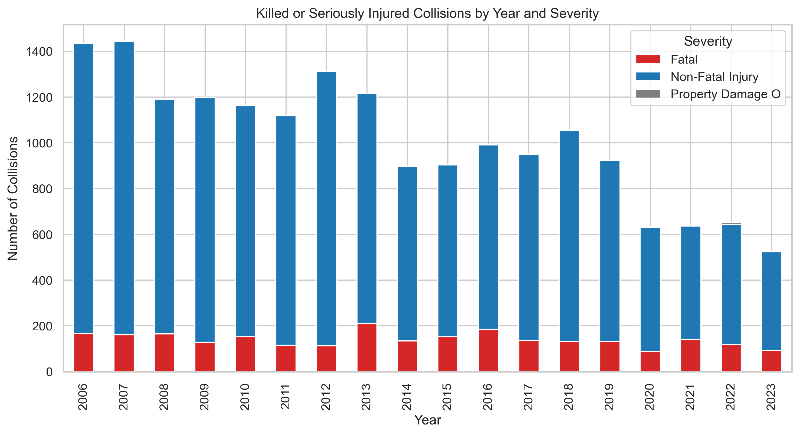
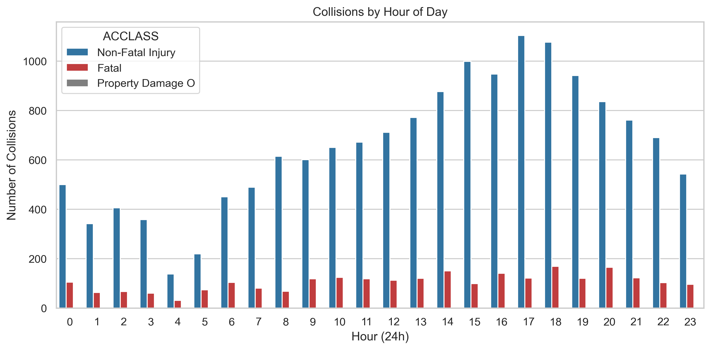
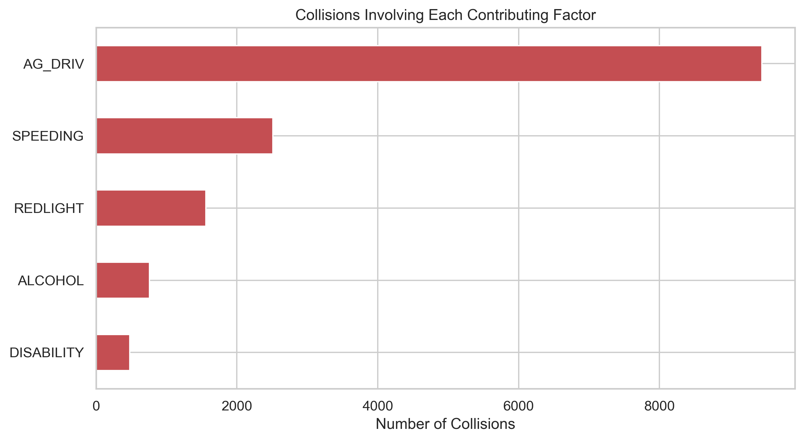
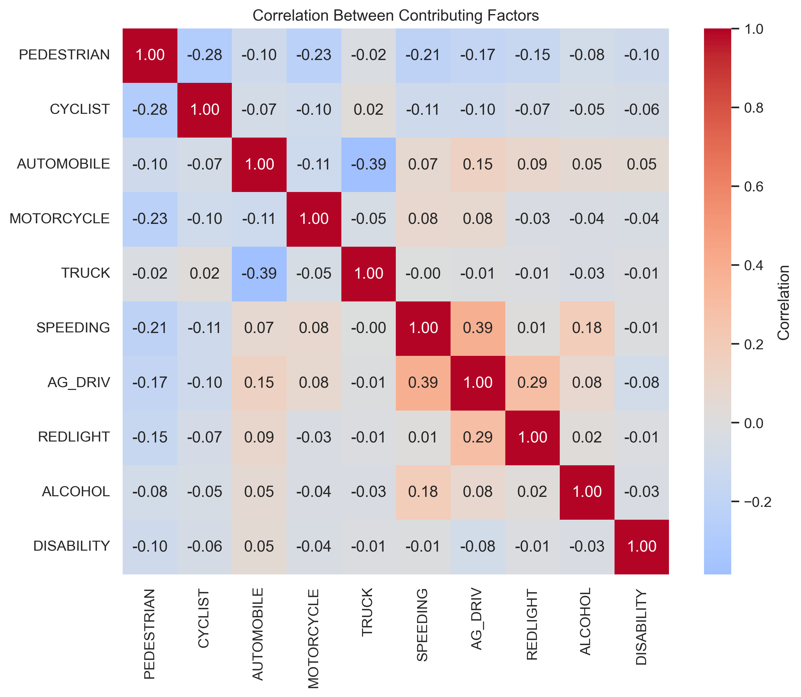
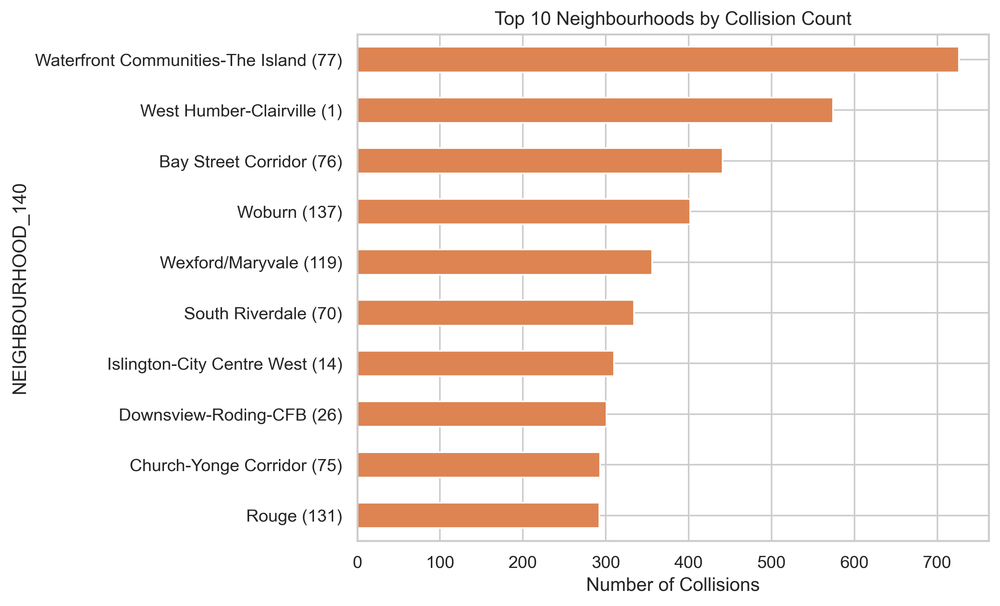

# Toronto Road Safety Intelligence — KSI Collision Risk Analysis

> **Can we predict whether a Toronto traffic collision will be fatal — before it happens?**  
> This project answers that question using 18 years of police collision records and supervised machine learning.

---

## Business Problem

Every year, hundreds of people are killed or seriously injured on Toronto roads. The City's **Vision Zero** initiative aims to eliminate traffic fatalities, but enforcement and infrastructure resources are limited. Knowing *where*, *when*, and *why* fatal collisions occur — and being able to predict severity *before* a collision becomes a statistic — enables city planners, traffic engineers, and law enforcement to act proactively rather than reactively.

**This project delivers:**
- A data-driven picture of collision trends, hotspots, and root causes from 2006–2023
- A machine learning pipeline capable of classifying collision severity (Fatal vs. Non-Fatal) from known risk factors
- Actionable insights to support resource allocation, enforcement campaigns, and infrastructure investment

---

## Key Findings at a Glance

### Collision Volume is Declining — But Fatal Events Persist



Total KSI collisions have fallen significantly since 2006 (peak ~1,440/year) to 2023 (~530/year) — a ~63% reduction reflecting Vision Zero interventions and improved road design. However, **fatal collisions remain stubbornly present at ~100–200 deaths per year**, showing that while frequency has dropped, severity has not been eliminated.

**Business implication:** Volume reduction campaigns are working. The next frontier is *severity reduction* — identifying and neutralising the conditions that turn a collision fatal.

---

### Peak Danger Window: Afternoon Rush Hour



Collisions peak sharply between **17:00–18:00** (over 1,100 non-fatal and ~170 fatal in the dataset). A secondary morning peak appears at 08:00. Fatal collisions are distributed more evenly across all hours — including overnight (0–4am), suggesting **impaired driving is a significant nighttime risk**.

**Business implication:** Enforcement resources (speed cameras, sobriety checks) should prioritise the 16:00–19:00 window for volume, and the 22:00–04:00 window for fatality risk.

---

### Aggressive Driving is the #1 Contributing Factor — by a Wide Margin



| Rank | Factor | Collisions Involved |
|------|--------|-------------------|
| 1 | Aggressive Driving (`AG_DRIV`) | ~9,200 |
| 2 | Speeding | ~2,500 |
| 3 | Red Light Running | ~1,550 |
| 4 | Alcohol | ~800 |
| 5 | Disability | ~500 |

Aggressive driving accounts for more KSI collisions than all other factors *combined*. Speeding and red-light running are co-occurring behaviours (correlation = 0.39 in the heatmap below).

**Business implication:** Behavioural enforcement — particularly targeting aggressive driving — offers the highest single-factor return on investment for reducing serious collisions.

---

### Risk Factors Cluster: Speed, Aggression, and Red-Light Running Travel Together



The correlation matrix reveals:
- **Speeding ↔ Aggressive Driving (0.39):** Drivers who speed tend to also exhibit aggressive behaviours — these are the same high-risk individuals.
- **Aggressive Driving ↔ Red Light Running (0.29):** A further cluster of reckless driving behaviour.
- **Pedestrian involvement is negatively correlated with automobile/motorcycle involvement** — incidents are predominantly one road-user type at a time.

**Business implication:** A single enforcement intervention targeting aggressive speeders addresses multiple correlated risk factors simultaneously.

---

### Collision Hotspots: Waterfront and West Humber Lead



The ten highest-collision neighbourhoods concentrate in high-traffic corridors:

| Rank | Neighbourhood | Collisions |
|------|--------------|------------|
| 1 | Waterfront Communities-The Island | 730 |
| 2 | West Humber-Clairville | 580 |
| 3 | Bay Street Corridor | 440 |
| 4 | Woburn | 400 |
| 5 | Wexford/Maryvale | 355 |

**Business implication:** Infrastructure investment (signal timing, pedestrian crossings, road calming) in these ten neighbourhoods would address a disproportionate share of total KSI events.

---

## Machine Learning Approach

The cleaned dataset is used to train a supervised classifier to predict `ACCLASS` (Fatal / Non-Fatal Injury) from collision attributes.

### Data Quality Strategy

Raw KSI data contains structured missingness — most "missing" values carry meaning (e.g., no alcohol entry = alcohol was *not* a factor). The pipeline applies domain-aware imputation rather than naive dropping:

| Group | Example Columns | Strategy | Rationale |
|-------|----------------|----------|-----------|
| Binary involvement flags | `ALCOHOL`, `SPEEDING`, `PEDESTRIAN` | Fill → `"No"` | NaN means the factor was absent |
| Role-conditional attributes | `PEDTYPE`, `CYCLISTYPE`, `DRIVACT` | Fill → `"Not Applicable"` | Only relevant for specific road-user types |
| Genuinely incomplete (<3% missing) | `ACCLASS`, `LIGHT`, `TRAFFCTL` | Drop rows | Truly unknown — cannot impute |
| High-volume unknown (~28% missing) | `ACCLOC`, `INITDIR` | Fill → `"Unknown"` | Too prevalent to drop without bias |
| Injury (conditional) | `INJURY` | Role-based fill | "None" for on-scene roles; "Not Applicable" for bystanders |

This approach preserves **all interpretable missingness** as a signal, rather than discarding it.

---

## Who Benefits From This Work

| Stakeholder | How They Use It |
|------------|----------------|
| **Toronto Traffic Management** | Identify high-risk corridors and times for signal optimisation |
| **Toronto Police Service** | Target enforcement at peak hours and high-risk behaviours |
| **City Planning / Vision Zero team** | Prioritise infrastructure investment by neighbourhood risk |
| **Insurance & Risk Analysts** | Risk scoring based on location, time, and environmental factors |
| **Policy Makers** | Evidence base for aggressive driving legislation |

---

## Running the Project

**Requirements:**
```
pandas
scikit-learn
matplotlib
seaborn
```

```bash
pip install pandas scikit-learn matplotlib seaborn
python public_safety_ml.py
```

**Outputs generated:**
- `1_collisions_by_year_severity.png` — Annual trend by severity class
- `2_collisions_by_hour.png` — Intraday collision distribution
- `3_contributing_factors.png` — Top behavioural risk factors
- `4_correlation_heatmap.png` — Factor co-occurrence matrix
- `5_top_neighbourhoods.png` — Highest-collision neighbourhoods

---

## Data Source

**Toronto Police Service — KSI Dataset** (`KSI_data.csv`)  
All killed or seriously injured traffic collision records reported in Toronto, 2006–2023.

---

*COMP247 — Supervised Learning | Centennial College, Semester 4*
